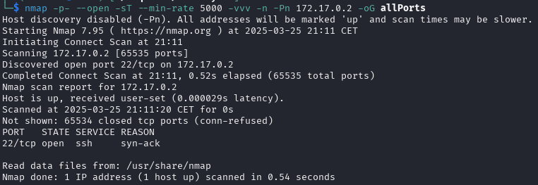
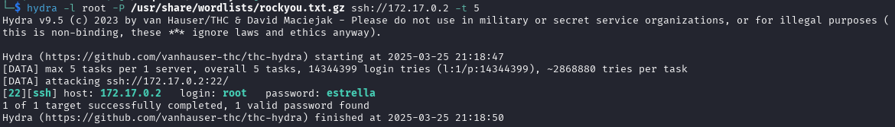
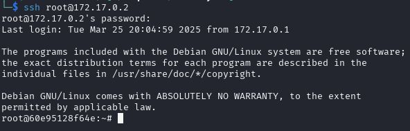

# BreakMySSH (muy fácil)


## Escaneo de puertos

Empezamos escaneando la máquina víctima con **nmap** para ver los puertos que tenga abiertos.

```shell
nmap -p- --open -sT --min-rate 5000 -vvv -n -Pn 172.17.0.2 -oG allPorts
```
Aquí está el desglose de cada opción:

* ``nmap`` → Es la herramienta que realiza el escaneo de puertos y redes.

* ``-p-`` → Escanea todos los puertos (0-65535).

* ``--open`` → Muestra solo los puertos que están abiertos.

* ``-sT`` → Realiza un escaneo de conexión TCP completa (TCP Connect Scan). Es más lento que el SYN scan (-sS), pero no requiere privilegios de root.

* ``--min-rate 5000`` → Exige que el escaneo se realice con una tasa mínima de 5000 paquetes por segundo, acelerando el proceso.

* ``-vvv`` → Muestra un nivel de detalle muy alto en la salida (modo verbose máximo).

* ``-n`` → No resuelve nombres de dominio (evita consultas DNS).

* ``-Pn`` → No realiza detección de host, asumiendo que el objetivo está activo.

* ``172.17.0.2`` → La dirección IP del objetivo a escanear.

* ``-oG allPorts`` → Guarda la salida en un archivo de texto llamado *allPorts*. **(OPCIONAL)**



Solo el puerto de **ssh** está abierto, por lo que podemos intentar directamente un ataque de fuerza bruta.

***

## Ataque

Para realizar el ataque, utilizaremos la herramiente ``hydra``.

```shell
hydra -l root -P /usr/share/wordlists/rockyou.txt.gz ssh://172.17.0.2 -t 5
```

Aquí está el desglose de cada opción:

* ``hydra`` → Ejecuta la herramienta de ataque de fuerza bruta.

* ``-l root`` → Especifica el nombre de usuario como ***root***.

* ``-P /usr/share/wordlists/rockyou.txt.gz`` → Usa el archivo de contraseñas **rockyou.txt.gz** (una lista de contraseñas comunes) como diccionario.
    > Nota: Kali ya incluye este y más diccionarios en /usr/share/wordlists

* ``ssh://172.17.0.2`` → Especifica que el ataque será contra el servicio SSH en la dirección 172.17.0.2.

* ``-t 5`` → Ejecuta 5 intentos simultáneos para aumentar la velocidad del ataque.



¡Parece que tenemos una coincidencia! La herramienta encontró que la contraseña de **root** es ***estrella***.

Procedemos a conectarnos a la máquina víctima mediante ssh.

```shell
ssh root@172.17.0.2
```

Aquí está el desglose de cada opción:

* ``ssh`` → Ejecuta el cliente SSH para conectarse a un servidor remoto.

* ``root@172.17.0.2`` → Indica que se quiere iniciar sesión como el usuario **root** en la dirección IP 172.17.0.2.



¡Y ya estaría! Ya somos **root** :).