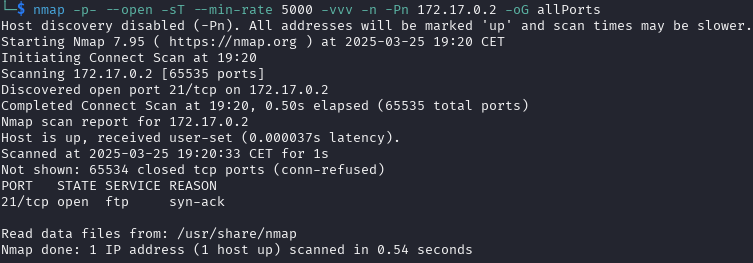
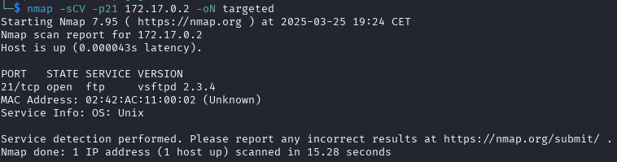
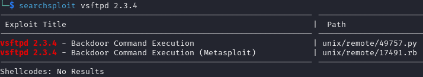
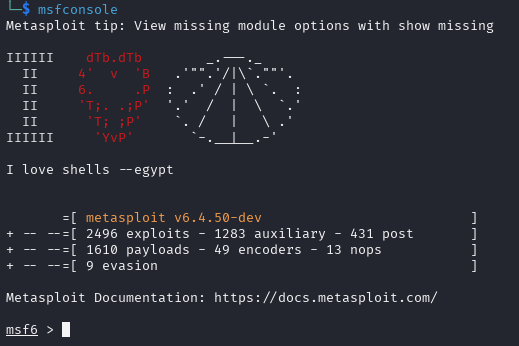
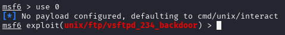
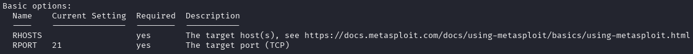
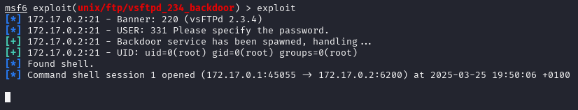

# FirstHacking (muy fácil)


## Escaneo de puertos

Empezamos escaneando la máquina víctima con **nmap** para ver los puertos que tenga abiertos.

```shell
nmap -p- --open -sT --min-rate 5000 -vvv -n -Pn 172.17.0.2 -oG allPorts
```
Aquí está el desglose de cada opción:

* ``nmap`` → Es la herramienta que realiza el escaneo de puertos y redes.

* ``-p-`` → Escanea todos los puertos (0-65535).

* ``--open`` → Muestra solo los puertos que están abiertos.

* ``-sT`` → Realiza un escaneo de conexión TCP completa (TCP Connect Scan). Es más lento que el SYN scan (-sS), pero no requiere privilegios de root.

* ``--min-rate 5000`` → Exige que el escaneo se realice con una tasa mínima de 5000 paquetes por segundo, acelerando el proceso.

* ``-vvv`` → Muestra un nivel de detalle muy alto en la salida (modo verbose máximo).

* ``-n`` → No resuelve nombres de dominio (evita consultas DNS).

* ``-Pn`` → No realiza detección de host, asumiendo que el objetivo está activo.

* ``172.17.0.2`` → La dirección IP del objetivo a escanear.

* ``-oG allPorts`` → Guarda la salida en un archivo de texto llamado *allPorts*. **(OPCIONAL)**



Como puedes ver, solo está abierto el puerto **ftp**. Vamos a escanearlo otra vez con **nmap**, pero esta vez utilizando un conjunto de scripts predeterminado para obtener más información.

```shell
nmap -sCV -p21 172.17.0.2 -oN targeted
```
Aquí está el desglose de cada opción:

* ``nmap`` → Es la herramienta que realiza el escaneo de puertos y redes.

* ``-sC`` → Ejecuta los scripts de detección predeterminados de **nmap** (--script=default). Estos incluyen comprobaciones de vulnerabilidades, autenticación anónima en FTP, etc.

* ``-sV`` → Detecta versiones de los servicios en ejecución en los puertos abiertos.

* ``-p21`` → Escanea únicamente el puerto 21 (FTP).

* ``172.17.0.2`` → La dirección IP del objetivo a escanear.

* ``-oN targeted`` → Guarda la salida en un archivo de texto llamado *targeted*. **(OPCIONAL)**



Una vez tenemos claro cuales son los puertos vulnerables, pasamos a la acción.
***

## Ataque

De acuerdo a la información obtenida con **nmap**, sabemos que la víctima tiene el puerto **ftp** abierto y que está en la versión **2.3.4**.

Empezamos buscando un **exploit** en [ExploitDB](https://www.exploit-db.com/). Para ello, utilizamos el comando ``searchsploit``.

```shell
searchsploit vsftpd 2.3.4
```



¡Parece que a dado resultado! Vemos que hay dos coincidencias.
En realidad, las dos son el mismo exploit, solo que uno está alojado en [Metasploit](https://www.metasploit.com/).

En esta práctica utilizaremos la segunda opción, ya que no hace falta que descarguemos nada.
Para ello, tendremos que abrir primero la consola de **Metasploit**.

```shell
msfconsole
```



> Nota: puedes utilizar ``msfconsole -q`` para iniciar en modo silencioso (que no aparezcan mensajes).

Una vez dentro, volvemos a buscar el exploit.

```shell
search vsftpd 2.3.4
```


Vemos que aparece como la opción 0, por lo que utilizamos el siguiente comando para usarlo.

```shell
use 0
```

Pero aparece un error...



Vamos a ver el porqué. Para ello utilizamos la opción ``info`` para ver la descripción del exploit.

```shell
info 0
```

Verás que aparecen muchas líneas con información, pero nos centraremos en ***Basic options***.



¡Claro, nos falta especificar la IP de la víctima!
> Nota: verás que también aparece una variable para establecer el puerto del objetivo, pero en este caso no es necesario, ya que el predeterminado (21) nos sirve.

Utilizando ``set`` podemos darle un valor a las variables que utilicen los exploits.

```shell
set RHOSTS 172.17.0.2
```

Para volver a iniciar el exploit ya solamente hace falta escribir ``exploit``.

```shell
exploit
```



***

## Extra

Te habrás dado cuenta que al estar en la shell, la terminal aparece "vacía". Esto se debe a que necesita tratamiento. Para ello, ejecuta los siguientes comandos:

```shell
script /dev/null -c bash
stty raw -echo
reset xterm
export TERM=xterm
export SHELL=/bin/bash
```

¡Y ya estaría! Si haces ``whoami`` podrás ver como eres **root** :).