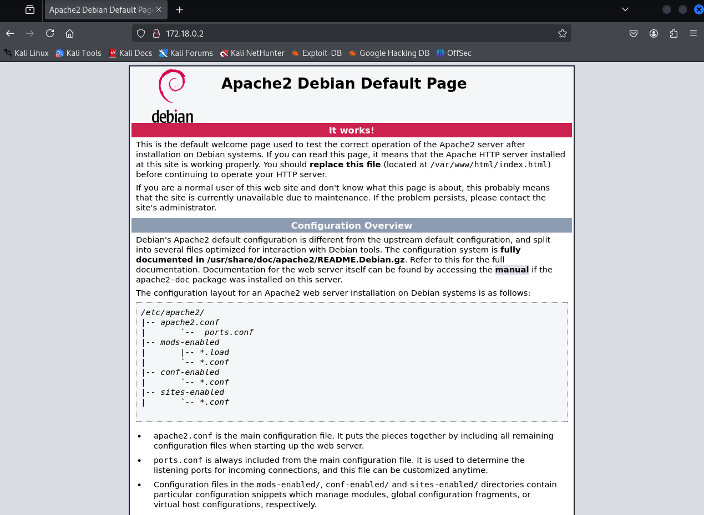

# Trust (muy fácil)


## Escaneo de puertos

Empezamos escaneando la máquina víctima con **nmap** para ver los puertos que tenga abiertos.

> Nota: puede que la IP variar

```shell
nmap -p- --open -sT --min-rate 5000 -vvv -n -Pn 172.18.0.2 -oG allPorts
```
Aquí está el desglose de cada opción:

* ``nmap`` → Es la herramienta que realiza el escaneo de puertos y redes.

* ``-p-`` → Escanea todos los puertos (0-65535).

* ``--open`` → Muestra solo los puertos que están abiertos.

* ``-sT`` → Realiza un escaneo de conexión TCP completa (TCP Connect Scan). Es más lento que el SYN scan (-sS), pero no requiere privilegios de root.

* ``--min-rate 5000`` → Exige que el escaneo se realice con una tasa mínima de 5000 paquetes por segundo, acelerando el proceso.

* ``-vvv`` → Muestra un nivel de detalle muy alto en la salida (modo verbose máximo).

* ``-n`` → No resuelve nombres de dominio (evita consultas DNS).

* ``-Pn`` → No realiza detección de host, asumiendo que el objetivo está activo.

* ``172.18.0.2`` → La dirección IP del objetivo a escanear.

* ``-oG allPorts`` → Guarda la salida en un archivo de texto llamado *allPorts*. **(OPCIONAL)**


Parece que tiene abiertos los puertos 22 (SSH) y 80 (HTTP). Vamos a escanearlos en profundidad.

```shell
nmap -sCV -p22,80 172.18.0.2 -oN targeted
```
Aquí está el desglose de cada opción:

* ``nmap`` → Es la herramienta que realiza el escaneo de puertos y redes.

* ``-sC`` → Ejecuta los scripts de detección predeterminados de **nmap** (--script=default). Estos incluyen comprobaciones de vulnerabilidades, autenticación anónima en FTP, etc.

* ``-sV`` → Detecta versiones de los servicios en ejecución en los puertos abiertos.

* ``-p22,80`` → Escanea los puertos 22 (SSH) y 80 (HTTP).

* ``172.18.0.2`` → La dirección IP del objetivo a escanear.

* ``-oN targeted`` → Guarda la salida en un archivo de texto llamado *targeted*. **(OPCIONAL)**


Echando un vistazo rápido, podemos ver que el puerto 22 está en la versión 9.2b1 de SSH, por lo que no es vulnerable. Vamos a ver qué página se está mostrando en el puerto 80.



Es la página por defecto de apache2. Si la revisamos, podrás ver que no está modificada, por lo que aquí no hay nada que nos interese.

Otra cosa que podemos probar es usar el comando ``gobuster`` para ver los directorios y archivos que contiene el servidor de la página web, por si hay algo interesante.

***

## Revisando directorios y archivos de la página web

```shell
gobuster dir -u http://172.18.0.2 -w /usr/share/wordlists/dirbuster/directory-list-2.3-small.txt -x html,php
```

Aquí está el desglose de cada opción:

* ``gobuster`` → Es la herramienta para descubrir archivos y directorios ocultos en servidores web.

* ``dir`` → Ejecuta gobuster en modo directorios, escaneando rutas en un servidor web.

* ``-u http://172.18.0.2`` → Define la URL objetivo.

* ``-w /usr/share/wordlists/dirbuster/directory-list-2.3-small.txt`` → Usa un diccionario de rutas (directory-list-2.3-small.txt) para buscar directorios y archivos comunes.

    > Nota: Kali ya incluye por defecto este y otros diccionarios en /usr/share/wordlists

* ``-x html,php`` → Busca archivos con extensiones html y php.


Como puedes ver, la herramienta ha encontrado varios archivos. A nosotros nos interesa **secret.php**. Vamos a abrirlo en el navegador.


Parece que es un mensaje para **Mario**... ¿Puede que sea un usuario del sistema?

***

## Oteniendo la contraseña de *mario*

Para acceder al usuario, vamos a realizar un ataque de fuerza bruta con ``hydra`` para buscar la contraseña para ***mario***.

```shell
hydra -l mario -P /usr/share/wordlists/rockyou.txt.gz ssh://172.18.0.2 -t 5
```

Aquí está el desglose de cada opción:

* ``hydra`` → Ejecuta la herramienta de ataque de fuerza bruta.

* ``-l mario`` → Especifica el nombre de usuario ***mario***.

* ``-P /usr/share/wordlists/rockyou.txt.gz`` → Usa el archivo de contraseñas **rockyou.txt.gz** (una lista de contraseñas comunes) como diccionario.
    > Nota: Kali ya incluye este y más diccionarios en /usr/share/wordlists

* ``ssh://172.18.0.2`` → Especifica que el ataque será contra el servicio SSH en la dirección 172.18.0.2.

* ``-t 5`` → Ejecuta 5 intentos simultáneos para aumentar la velocidad del ataque.


¡Ya tenemos la contraseña! Vamos a acceder mediante SSH.

***

## Accediendo mediante SSH como *mario*

```shell
ssh mario@172.18.0.2
```


Revisamos qué comandos podemos ejecutar con ``sudo``.

```shell
sudo -l
```


Podemos ejecutar **vim** con sudo, por lo que entramos en [GTFOBins](https://gtfobins.github.io/) para ver si podemos explotar esto.

***

## Accediendo a root


Tenemos tres coincidencias, pero nos vamos a centrar en la segunda: **vim** normal y corriente.


Copiamos el primer comando y lo pegamos en la terminal para ejecutarlo con ``sudo`` como ***mario***.

```shell
sudo vim -c ':!/bin/sh'
```


¡Y ya estaría! Ya somos **root** :).