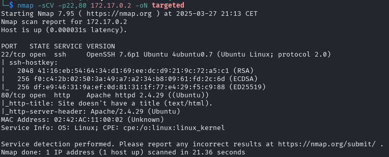

# Vacaciones (muy fácil)


## Escaneo de puertos

Empezamos escaneando la máquina víctima con **nmap** para ver los puertos que tenga abiertos.

```shell
nmap -p- --open -sT --min-rate 5000 -vvv -n -Pn 172.17.0.2 -oG allPorts
```
Aquí está el desglose de cada opción:

* ``nmap`` → Es la herramienta que realiza el escaneo de puertos y redes.

* ``-p-`` → Escanea todos los puertos (0-65535).

* ``--open`` → Muestra solo los puertos que están abiertos.

* ``-sT`` → Realiza un escaneo de conexión TCP completa (TCP Connect Scan). Es más lento que el SYN scan (-sS), pero no requiere privilegios de root.

* ``--min-rate 5000`` → Exige que el escaneo se realice con una tasa mínima de 5000 paquetes por segundo, acelerando el proceso.

* ``-vvv`` → Muestra un nivel de detalle muy alto en la salida (modo verbose máximo).

* ``-n`` → No resuelve nombres de dominio (evita consultas DNS).

* ``-Pn`` → No realiza detección de host, asumiendo que el objetivo está activo.

* ``172.17.0.2`` → La dirección IP del objetivo a escanear.

* ``-oG allPorts`` → Guarda la salida en un archivo de texto llamado *allPorts*. **(OPCIONAL)**


Parece que tiene abiertos los puertos 22 (SSH) y 80 (HTTP). Vamos a escanearlos en profundidad.

```shell
nmap -sCV -p22,80 172.17.0.2 -oN targeted
```
Aquí está el desglose de cada opción:

* ``nmap`` → Es la herramienta que realiza el escaneo de puertos y redes.

* ``-sC`` → Ejecuta los scripts de detección predeterminados de **nmap** (--script=default). Estos incluyen comprobaciones de vulnerabilidades, autenticación anónima en FTP, etc.

* ``-sV`` → Detecta versiones de los servicios en ejecución en los puertos abiertos.

* ``-p22,80`` → Escanea los puertos 22 (SSH) y 80 (HTTP).

* ``172.17.0.2`` → La dirección IP del objetivo a escanear.

* ``-oN targeted`` → Guarda la salida en un archivo de texto llamado *targeted*. **(OPCIONAL)**



Revisando los datos, nos damos cuenta que el puerto 22 corre la versión 7.6p1 de SSH, por lo que no es vulnerable. En cambio, el puerto 80 parece más interesante, ya que está mostrando una página web que no es la predeterminada de apache2 (nos podemos dar cuenta al ver que la web no tiene título). vamos a verla en el navegador.

***

## Revisando la página web

Para ello pondremos el siguiente link en un navegador cualquiera **en el mismo ordenador donde estamos ejecutando la máquina vulnerable**:

```shell
https://172.17.0.2
```


Vaya, vaya. parece que está vacía. Vamos a revisar el código fuente a ver si hay algo interesante.


¡Tenemos algo! Parece que Juan le envió a Camilo un correo importante...
Suponemos que son usuarios del sistema, por lo que vamos a probar un ataque de fuerza bruta para ver si podemos acceder a alguno de ellos. Usamos la herramienta ``hydra`` para hacerlo.

***

## Fuerza bruta para intentar acceder al usuario *camilo*

```shell
hydra -l camilo -P /usr/share/wordlists/rockyou.txt.gz ssh://172.17.0.2 -t 5
```

Aquí está el desglose de cada opción:

* ``hydra`` → Ejecuta la herramienta de ataque de fuerza bruta.

* ``-l camilo`` → Especifica el nombre de usuario ***camilo***.

* ``-P /usr/share/wordlists/rockyou.txt.gz`` → Usa el archivo de contraseñas **rockyou.txt.gz** (una lista de contraseñas comunes) como diccionario.
    > Nota: Kali ya incluye este y más diccionarios en /usr/share/wordlists

* ``ssh://172.17.0.2`` → Especifica que el ataque será contra el servicio SSH en la dirección 172.17.0.2.

* ``-t 5`` → Ejecuta 5 intentos simultáneos para aumentar la velocidad del ataque.


Ya tenemos la contraseña, por lo que accedemos al usuario mediante **ssh**.

***

## Accediendo a la máquina como *camilo*

```shell
ssh camilo@172.17.0.2
```


> Nota: Si ya has completado máquinas anteriormente y usado ssh en ellas, tendrás que ejecutar el siguiente comando para resetear la información que tenga tu ordenador sobre el destino: ``ssh-keygen -f '~/.ssh/known_hosts' -R '172.17.0.2'``

***

## Leyendo el correo

Vamos a acceder a la carpeta ``mail`` para ver si **camilo** a recibido el correo de **Juan**.

```shell
cd /var/mail
ls
cd camilo
ls
```


Parece que si recibió el correo. Vamos a ver su contenido.

```shell
cat correo.txt
```


Y así de simple ya tenemos la contraseña de **Juan**.

***

## Accediendo al usuario *juan*

Para acceder a su usuario es tan simple como escribir:

```shell
su juan
```

Y escribir la contraseña.


Para comprobar qué usuario somos utilizamos ``whoami``.

```shell
whoami
```


Sip, ya somos **juan**.

Ahora, vamos a ver que comandos podemos ejecutar con **sudo**.

```shell
sudo -l
```


Podemos ejecutar **ruby**. Para ver qué podemos hacer con esta información, entramos en [GTFOBins](https://gtfobins.github.io/) y buscamos el ejecutable. En esta página podemos buscar programas que, al ejecutar ciertas ordenes, nos permiten crear shells, reverse shells, subir archivos, etc. **RECUERDA ESTA PÁGINA, PORQUE SERÁ MUY ÚTIL EN FUTURAS MÁQUINAS**.

***

## Obteniendo acceso a root

Buscamos "ruby" en GTFOBins.


Hay una coincidencia. Vamos a verla.


Copiamos el primer comando y lo ejecutamos en la máquina como **juan**.

```shell
sudo ruby -e 'exec "/bin/sh"'
```

> Nota: aunque en la página el comando aparezca sin "sudo", hay que ponerlo para que funcione.

> Nota: el comando también funciona si en vez de "/bin/sh" ponemos /bin/bash.


¡Y ya estaría! Ya somos **root** :).